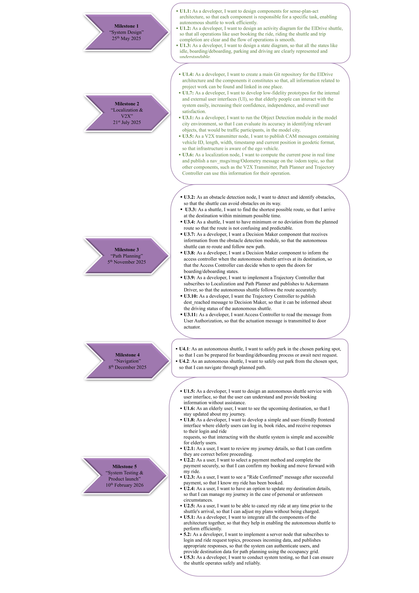
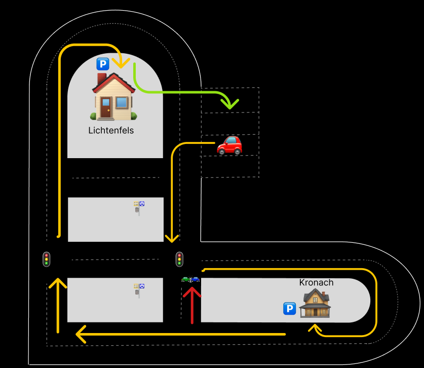
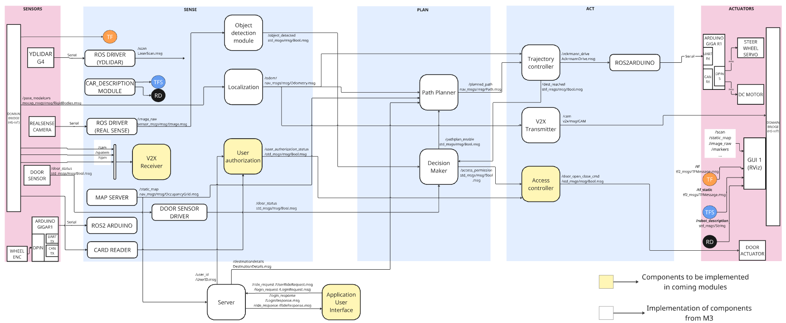

# ElDriveMain

# Introduction

**Eldrive** is an innovative and socially driven team of six members working on an impactful project titled **"Autonomous Shuttle for the Elderly in Rural Bavaria."** Our mission is to support elderly individuals living in the Bavarian countryside who face difficulties in maintaining their mobility and social connections.

We aim to develop an **autonomous, on-demand, door-to-door shuttle service** that empowers elderly people to visit friends and family and stay engaged with their community all while preserving their independence and dignity. By combining advanced sensing, planning, and control technologies, Eldrive envisions a future where rural mobility challenges are addressed with cutting-edge autonomous solutions.

# Object detection

- [Object detection evaluation](./objectdetection.md)

# Table of Contents

- [Question Zero](#question-zero)
- [Persona](#persona)
- [User-story map](#user-story-map)
- [Milestones](#milestones)
- [Use Case](#use-case)
- [Scenario](#scenario)
- [Architecture](#architecture)
  - [Block Diagram (Sense-Plan-Act Architecture)](#block-diagram-sense-plan-act-architecture)
  - [State Diagram](#state-diagram)
  - [Activity Diagram](#activity-diagram)
- [User Interface Concepts](#user-interface-concepts) 
- [Component Responsibilities](#component-responsibilities)
- [Team roles and responsibilities](#team-roles-and-responsibilities)

## Question Zero

How can we assist the senior citizens who face difficulties visiting their friends and family by providing an autonomous on demand vehicle service that goes door to door in Bavarian countryside?

## Persona

**Emma Heller**, a 68-year-old retired teacher living alone in Kronach, enjoys visiting her friends and family.

## User-story map

An overview of key user journeys to guide the development of our autonomous shuttle service.

---

## Milestones

An outline of our key development phases, visualized through structured planning.

  

##  Use Case 
Emma, a 68-year-old living in rural Kronach, uses the Eldrive application to book a shuttle ride to her daughter’s home in Lichtenfels. She selects a pre-registered ride option, reviews the details, and confirms the booking with her saved credit card, and sees a “Ride Confirmed” message.

## Scenario

Emma Heller, a 68-year-old woman living in a rural area of Kronach, wants to visit her daughter in Lichtenfels. She taps her phone’s NFC card, which opens the application, and on the simple page displaying five pre-registered destination details, she selects “Kronach–Lichtenfels.” Then it leads to the payment page. After successful payment, she receives a confirmation message on her phone as “Ride confirmed.” After that, she can track the shuttle’s live location using the tracking page.

The autonomous shuttle receives the booking request and departs from its dedicated parking space, taking the shortest route to Emma’s pick-up location. Throughout the ride, it follows all traffic rules and regulations. While driving, the shuttle continuously identifies its location and position using the localization component. The localization component helps the V2X transmitter that publishes Cooperative Awareness Messages (CAM).

The shuttle initially follows a pre-planned route. If any unexpected events occur, it uses V2X communication and object detection inputs to adjust its path, ensuring a smooth and timely arrival. When it reaches Emma’s location, the shuttle finds an available parking space and stops safely so she can board.

After Emma gets in, the shuttle calculates the best route to her daughter’s home. When she takes a seat, there is a Human-Machine Interface (HMI) that greets her with a welcome message. This HMI displays information about the current ride and shows her real-time location. It also includes an entertainment button. Additionally, it provides options to cancel the ride, request help or to trigger an emergency alert if needed.

Along the way, it detects a car involved in an accident blocking the planned route using its object detection module. In response, it automatically replans the route and takes an alternative path to continue the ride.

Once it arrives, the shuttle locates a suitable parking space and parks safely. When Emma exits the vehicle, the shuttle starts searching for the most efficient route back to its dedicated parking area.

  

# Architecture

The architecture consists of the following diagrams:

- **Block Diagram**
- **State Diagram**
- **Activity Diagram**

Additionally, the responsibilities of the individual components are also listed here.

## Block Diagram (Sense-Plan-Act Architecture)

System architecture is illustrated in the mentioned block diagram, consisting of distinct functional layers like sense, plan and act. The sensors perceive the surroundings to assist the sense layer to process and interpret the environment, actuators execute the commands given via act layer. 

The **Sensor layer** foremost helps perceive the environment using several components like Lidar, Realsense camera and door actuator. Camera and Lidar are the sole agents to perceive the environment. A door sensor has been implemented to sense the status of the shuttle’s doors and boarding aid, if they are open or closed to identify the transition between shuttle’s states. We begin with the sense layer, that serves as the bridge between sensors and plan layer.
The Sense layer consists of Localization that identifies the shuttle’s position in real time. Object detection is employed to identify objects in its perception field. V2X receiver’s purpose is to interpret V2X messages like /cam, /spatem, /cpm, being transmitted via the V2X infrastructure, sort this information to respective following components that have further requirements of these messages. Map server consists of static map data, that helps server to interpret boarding points received from user end. Additionally, User authorization component, Card reader and Door sensor driver are new implementations amongst this layer. The Door sensor driver acts as a bridge between the Door sensor and plan layer to provide processed data into Boolean messages. Card reader translates User NFC card details to feed User authorization component with the user booking ID details. The User authorization component processes this info to grant or deny permission to open doors for users to board the shuttle. Based on all the sensed and processed information we move onto the plan layer, where the shuttle’s mobility is enabled.

The **Plan layer** comprehends the environment to identify vehicle state, decides to enable path planning and converts them into refined messages to assist act layer further. The decision maker expects input from door sensor driver to identify shuttle’s state. Object Detection module is supposed to inform Decision Maker of any objects detected on the path, so Decision Maker can be able to identify if it’s an obstacle or not. Decision Maker is the only component that expects input from Trajectory Controller from act layer to identify the shuttle’s state transition and enable or disable Path Planner. Further, access control in act layer is also given Boolean message from Decision Maker to enable or disable the doors and boarding aid. Path Planner expects permission from Decision Maker to plan path by deriving inputs from Localization, to be aware of ego vehicle position. Server provides the destination details; map server provides the local static map and road network information to Path Planner. Based on all these inputs, Path Planner plans a path from shuttle’s current position to the consecutive destinations being provided by the Server and forwards the message to Trajectory Controller on the act layer.

The **Act layer** comprises a Trajectory Controller, V2X Transmitter, and Access Controller. The Trajectory Controller takes the odometry data from Localization to know the current state of the vehicle (position, orientation, velocity) and another input as the planned path from the Path Planner and passes necessary messages to Ackermann Driver to control vehicle speed, steering angle and braking commands to be executed by the actuator layer. Further on, the Trajectory Controller informs the Decision Maker about the trajectory execution status, if it is completed. The V2X transmitter is expected to transmit a /CAM message that briefs the ego vehicle location in geodetic format, vehicle ID, vehicle length and width to inform the local V2X infrastructure. Access control simply passes Boolean messages to Door actuator, to enable or disable doors and boarding aid.

Furthermore, **Server** and **Application UI** components are implemented alongside the above layers. Server communicates with Application UI to fetch destination details that the user provides. Server interprets data from map server to pass on destination details to path planner in coordinates format. Further, servers share the User booking ID with User authorization to authorize the user and let them board the shuttle.

The **Actuators layer** expect messages from the act layer to execute commands like steering, acceleration, and braking. Door actuator actuates the opening and closing operations of the door and boarding aid.

To access the Block diagram use the given link: https://miro.com/app/board/uXjVI07JyIQ=/

  

## State Diagram

The state diagram represents the various stages the shuttle transitions through during its operation. The journey begins in the **idle state**, where the shuttle remains stationary with its doors closed, awaiting incoming user requests. Once a request is received, the system begins planning an optimal route to the destination. After route planning is completed, the shuttle transitions into the **driving state**, navigating along the planned route.

Upon reaching the destination, the shuttle transitions to the **parking state**, where it searches for an appropriate parking spot and follows a planned trajectory to park safely. Once parked, the system proceeds to the **boarding/deboarding state**. Here, the shuttle opens its doors and activates boarding aids, allowing users to board or exit. It also verifies user authorization and ensures the boarding or deboarding process is complete.

After this process, the shuttle either returns to the **driving state** to continue its journey to the next stop or, if the final user has deboarded, transitions back to the **parking state**. From there, once securely parked, it enters the **idle state** again.

  

## Activity Diagram

The elderly user makes a booking for the shuttle through the designated interface whenever in need; this action initiates a request including all required user details.

The system registers user information and determines a feasible route to the pick-up point, considering road conditions, traffic, and accessibility for the elderly user. The system generates confirmation of the ride, notifying the user that the ride is accepted and the shuttle is en route.

Before the system generates the confirmation, it enables the user to modify the pre-existing pick-up and drop-off locations to accommodate last-minute changes in destination or timing. Another request is raised and processed accordingly.

On confirmation by the user, the shuttle navigates to the pick-up location. During navigation, the system checks for interruptions such as obstacles and unexpected delays. If detected, the shuttle maneuvers to safely bypass them. The shuttle reaches the location and parks while waiting for the user.

Once parked at the pick-up or destination, user authorization is completed, and the shuttle automatically opens doors and enables boarding aids such as ramps or lifting platforms for the user. The shuttle ensures the user boards or deboards safely before withdrawing the boarding aid and closing doors, avoiding any mishap.

Upon completion of the ride, the shuttle waits for further requests. If a new request is raised, the shuttle sends confirmation and repeats the procedure as described.

  

## User Interface Concepts
To access External and Internal User Interfaces use the below links:

- [Extrenal UI](https://git.hs-coburg.de/eldrive/User_Interface_Concepts/src/branch/main/External_hmi.md) 
- [Internal UI](https://git.hs-coburg.de/eldrive/User_Interface_Concepts/src/branch/main/Internal_hmi.md)

## Component Responsibilities

| Component Name                | Author                   |
|-------------------------------|--------------------------|
| [V2X Transmitter](https://git.hs-coburg.de/eldrive/V2X_Transmitter)            | Saniya Eram              |
| [Trajectory controller](https://git.hs-coburg.de/eldrive/TrajectoryController) | Khadija Mahboob Alam     |
| [Decision Maker](https://git.hs-coburg.de/eldrive/Decision_Maker)              | Rinkal Viradiya          |
| [Path Planner](https://git.hs-coburg.de/eldrive/Path_planner)                  | Lingaprasath Nagarajan   |
| [Localization](https://git.hs-coburg.de/eldrive/Localization)                  | Stanislav Fomin          |
| [Server](https://git.hs-coburg.de/eldrive/Server)                              | Karthik Chowdary Nunna   |

## Team roles and responsibilities
| Team Member              | Roles                  |Responsibilities|
|--------------------------|------------------------|-----------------------|
|Stanislav Fomin           | Scrum Master           |Implements agile ceremonies and ensures team integrity|
|Karthik Chowdary Nunna    | Documentation reviewer    |Reviews and ensures accuracy of the documentation|
|Khadija Mahboob Alam      | Defining milestones    | Establishes key milestones and tracks progress|
|Lingaprasath Nagarajan    | Assessment of team competency |Track improvements over time|
|Rinkal Viradiya           | Documentation reviewer |Reviews and ensures accuracy of the documentation|
|Saniya Eram               | Planning deliverables  |Defines deliverables to meet timelines |

## License

Licensed under the **Apache 2.0 License**. See [LICENSE](LICENSE) for details.
