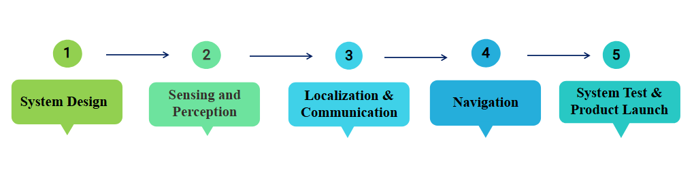

# ElDrive_Main

# Introduction

**Eldrive** is an innovative and socially driven team of six members working on an impactful project titled **"Autonomous Shuttle for the Elderly in Rural Bavaria."** Our mission is to support elderly individuals living in the Bavarian countryside who face difficulties in maintaining their mobility and social connections.

We aim to develop an **autonomous, on-demand, door-to-door shuttle service** that empowers elderly people to visit friends and stay engaged with their community all while preserving their independence and dignity. By combining advanced sensing, planning, and control technologies, Eldrive envisions a future where rural mobility challenges are addressed with cutting-edge autonomous solutions.

---

# Table of Contents

📚 Table of Contents

- [Problem Definition](#-problem-definition)
- [Question Zero](#-question-zero)
- [Persona](#persona)
- [Story Map](#story-map)
- [Milestones](#milestones)
  - [System Design](#milestone-1-system-design)
  - [Sensing and Communication](#milestone-2-sensing-and-communication)
  - [Planning and Control](#milestone-3-planning-and-control)
  - [Unique Selling Point](#milestone-4-unique-selling-point)
  - [Product Launch](#milestone-5-product-launch)
- [User Stories (Milestone 2)](#user-stories-milestone-2)
- [Use Case Scenario](#use-case-scenario)
- [Architecture](#architecture)
- [Block Diagram](#block-diagram)
- [State Diagram](#state-diagram)
- [Activity Diagram](#activity-diagram)
- [Component Responsibilities](#component-responsibilities)
- [Team Roles and Responsibilities](#team-roles-and-responsibilities)
- [Repositories Overview](#repositories-overview)

---

## 🧩 Problem Definition

## ❓ Question Zero

How can we assist the senior citizens who face difficulties visiting their friends and family by providing an autonomous on demand vehicle service that goes door to door in Bavarian countryside?

---

---

## 👵 Persona

**Emma Heller**, a 68-year-old retired teacher living alone in Kronach, enjoys visiting her friends and family.

---

## 🗺️ Story Map

An overview of key user journeys to guide the development of our autonomous shuttle service.

---

---

## 🛤️ Milestones

An outline of our key development phases, visualized through structured planning.

  

### 🧱 Milestone 1: System Design
**Timeline:** May 2025 &nbsp;&nbsp;|&nbsp;&nbsp; **Module:** 2  
In this milestone, we developed a user story map and derived user stories based on user and system requirements. Further on we also designed the system architecture according to the Sense-Plan-Act architecture and based on that we were also able to understand and develop components for the architecture, designed an activity and a state diagram which enabled us to develop conceptual knowledge of our project.

### 🛰️ Milestone 2: Sensing and Perception
**Timeline:** July 2025 &nbsp;&nbsp;|&nbsp;&nbsp; **Module:** 3  
This milestone focuses on in-depth learning of different components used in our project along with developing the understanding about different state-of-the-art sensor technologies. Furthermore, efforts will be made in learning about sensor calibration and sensor fusion techniques for our project and vehicle connectivity. As a result, this will help in developing an understanding of vehicle-to-everything (V2X) communication systems with respect to shuttle and the environment.

### 📡 Milestone 3: Localization & Communication
**Timeline:** Oct 2025 &nbsp;&nbsp;|&nbsp;&nbsp; **Module:** 4  
This milestone aims to develop an understanding of different map representations and implementing them in our project. This will be helpful for the localization component of our system. Moreover, with the help of previously learned concepts of sensor fusion techniques, we will be able to implement them along with the established V2X communication.

### 🧭 Milestone 4: Navigation
**Timeline:** Dec 2025 &nbsp;&nbsp;|&nbsp;&nbsp; **Module:** 5  
This milestone functions towards route and trajectory planning along with localization and mapping. Here we will be integrating all the components of the autonomous shuttle along with implementing path planning algorithms developed in milestone 3. An application user interface will be implemented enabling the users to book the ride with key features efficiently.

### 🚀 Milestone 5: System Test & Product Launch
**Timeline:** Feb 2025 &nbsp;&nbsp;|&nbsp;&nbsp; **Module:** 6  
In this milestone testing and validation of the system will be done to prepare the product prototype for launch. Autonomous shuttle with all the components integrated will go through series of testing and validation under various scenarios completing the verification of the product and all the requirements. After the thorough evaluation, the product will be launched.

---

---

## 🎯 Use Case Scenario

*(Description to be added soon)*

  

---

# Architecture

The architecture consists of the following diagrams:

- **Block Diagram**
- **State Diagram**
- **Activity Diagram**

Additionally, the responsibilities of the individual components are also listed here.

---
## Block Diagram (Sense-Plan-Act Architecture)

The system’s architecture is depicted by the following block diagram, composed of sensors, sense, plan, act, and actuators layers.

- **Sensors Layer:** Provides essential input data via intermediate ROS modules. The YDLIDAR sensor, assisted by the ROS driver, generates a 3D map of the local environment fed into the localization module. The RealSense camera, assisted by ROS2 modules, provides image data for object detection. A V2X receiver enables cooperative driving by sourcing data from nearby infrastructure (CAM, SPATEM, CPM). The map server provides global map data, including road geometry and road signs.

- **Sense Layer:** Processes data from sensors. Localization determines the shuttle’s real-time position. Object detection identifies obstacles and traffic participants. Lane detection helps the shuttle stay centered within lanes, handling complex scenarios like intersections.

- **Plan Layer:** Comprises route planning, trajectory planning, and decision-making. Route planning uses map data and road topology to calculate a global path to the destination. Decision-making determines high-level maneuvers (e.g., halting, overtaking, lane changes) based on real-time driving conditions such as obstacles, traffic laws, and other vehicle behaviors. Trajectory planning generates continuous, time-parameterized paths that minimize jerk, acceleration, deceleration, and steering while following the planned route.

- **Act Layer:** Converts high-level plans into low-level control commands. The trajectory follower within this layer executes motion plans, converting them into control signals such as steering angles (for lateral control) and motor speeds (for longitudinal travel), which directly control the shuttle hardware.

Additionally, the system includes:

- **Application User Interface:** The primary interaction point for users to initiate ride requests, monitor journey status, and receive journey details in real time.

- **Server:** Supports system functions by maintaining user data and communicating user pickup and destination details to the route planning module.

---

## State Diagram

The state diagram represents the various stages the shuttle transitions through during its operation. The journey begins in the **idle state**, where the shuttle remains stationary with its doors closed, awaiting incoming user requests. Once a request is received, the system begins planning an optimal route to the destination. After route planning is completed, the shuttle transitions into the **driving state**, navigating along the planned route.

Upon reaching the destination, the shuttle transitions to the **parking state**, where it searches for an appropriate parking spot and follows a planned trajectory to park safely. Once parked, the system proceeds to the **boarding/deboarding state**. Here, the shuttle opens its doors and activates boarding aids, allowing users to board or exit. It also verifies user authorization and ensures the boarding or deboarding process is complete.

After this process, the shuttle either returns to the **driving state** to continue its journey to the next stop or, if the final user has deboarded, transitions back to the **parking state**. From there, once securely parked, it enters the **idle state** again.

  

---

## Activity Diagram

The elderly user makes a booking for the shuttle through the designated interface whenever in need; this action initiates a request including all required user details.

The system registers user information and determines a feasible route to the pick-up point, considering road conditions, traffic, and accessibility for the elderly user. The system generates confirmation of the ride, notifying the user that the ride is accepted and the shuttle is en route.

Before the system generates the confirmation, it enables the user to modify the pre-existing pick-up and drop-off locations to accommodate last-minute changes in destination or timing. Another request is raised and processed accordingly.

On confirmation by the user, the shuttle navigates to the pick-up location. During navigation, the system checks for interruptions such as obstacles and unexpected delays. If detected, the shuttle maneuvers to safely bypass them. The shuttle reaches the location and parks while waiting for the user.

Once parked at the pick-up or destination, user authorization is completed, and the shuttle automatically opens doors and enables boarding aids such as ramps or lifting platforms for the user. The shuttle ensures the user boards or deboards safely before withdrawing the boarding aid and closing doors, avoiding any mishap.

Upon completion of the ride, the shuttle waits for further requests. If a new request is raised, the shuttle sends confirmation and repeats the procedure as described.

  

---

## Component Responsibilities

| Component Name                 | Author                   |
|-------------------------------|--------------------------|
| [V2X receiver](https://gitea.example.com/your-org/trajectory-planning)         | Saniya Eram              |
| [Trajectory controller](https://gitea.example.com/your-org/trajectory-follower)         | Khadija Mahboob Alam     |
| [Decision Maker](https://gitea.example.com/your-org/decision-making)                 | Rinkal Viradiya          |
| [Path Planner](https://gitea.example.com/your-org/route-planning)                   | Lingaprasath Nagarajan   |
| [Localization](https://git.hs-coburg.de/eldrive/Localization)                       | Stanislav Fomin          |
| [Application User Interface](https://gitea.example.com/your-org/application-ui)       | Karthik Chowdary Nunna   |
| [Server](https://gitea.example.com/your-org/server)                                 | Karthik Chowdary Nunna   |

