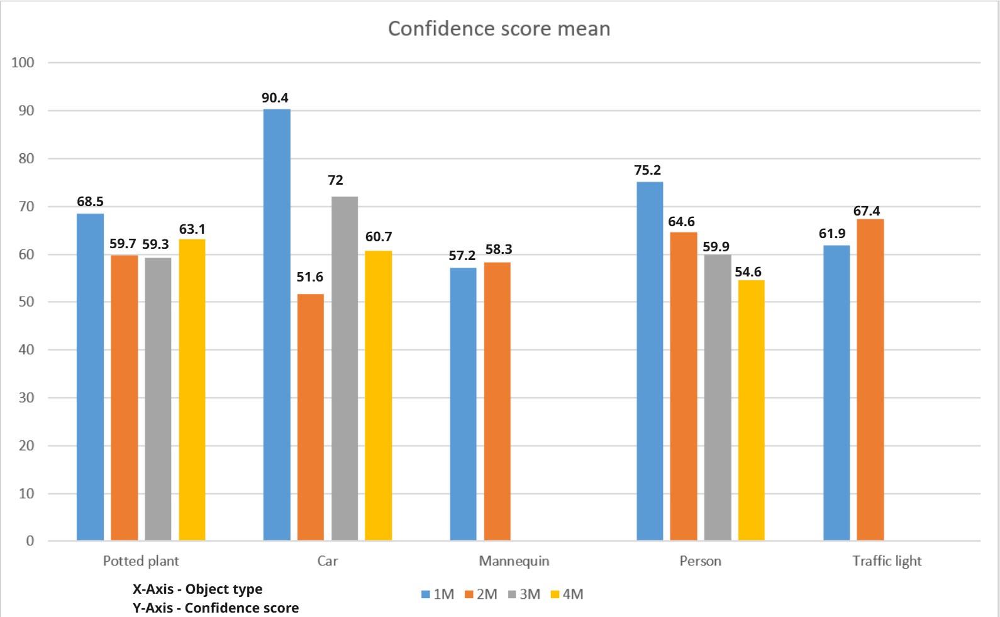

# Object Detection Evaluation 

## 1. Introduction

The object detection module is important for ego vehicle perception of the surroundings. This module allows ego vehicles to identify different objects such as human-being, traffic signs/lights, and obstacle in real time. Without reliable object detection, the ego vehicle will not able to operate in the full conditions.  
For this reason, we conducted an object detection evaluation. In our model car, the object detection is based on DetectNet. The principal goal of this evaluation is to observe how the model performs under particular lighting conditions and when detecting various types of objects. The evaluation was conducted in the model city at Hochschule Coburg, using a set of objects to examine the system’s behaviour.  
We are interested in how the model’s confidence score respond to different object types and distances. At short distances, we expect classification to be accurate (identify correct object class) and confidence score to be high. At the increased distances, we expect classification to be consistent, the confidence score will be lower than in shorter distances.

## 2. Description of the Environment

The object detection evaluation was conducted in the model city environment by using the ElDrive model car with ID 5. The evaluation scenario included controlled light conditions: shutters in the model city were completely open to allow natural light in, moreover, model city lights were turned on. This light setup ensured illumination for evaluating the object detection performance under realistic lighting conditions. The model city objects such as traffic lights, mannequins, car were placed in front of the model car with running obstacle detection module. Evaluation was conducted in stationary scenario.

## 3. Interfaces

| Topic Name           | Input/Output | Message Type                     | Description                                                                      |
| -------------------- | ------------ | -------------------------------- | -------------------------------------------------------------------------------- |
| /video_source/raw    | Input        | sensor_msgs/msg/Image            | Provides raw images frames from the real sense camera.                           |
| /detectnet/detections | Output       | vision_msgs/msg/Detection2DArray | Publishes detected objects, including class, confidence score, and bounding box. |

## 4. Observation

Once the environment setting was defined, 5 Different objects from the model city, those would be the traffic participants were chosen as the differentiating parameter for object types. The objects were namely, car, potted plant, traffic light, mannequin and person. Distance parameter differentiation for all the objects were uniform. Distance of 1 metre, 2 meters, 3 meters and 4 meters away from the ego vehicle’s camera was assumed as the setting to evaluate the object detection.  
Each of the object was placed in the above-mentioned distances, away from the car to note down the respective confidence scores. We logged in to the Jetson in our car from the workstation to run object detection module to view the confidence score via rqt/image plot. Also, we observed 7 iterations for each distance condition for each object, so that we have a mean confidence score for every object being detected at various distances.  
For example, potted plant was placed 1 meter away from the car and the confidence score was recorded 7 times. The experiment was repeated with the same object at consecutive distances, then the next object at different distances away from the car, each with 7 iterations in observation. The entire observation was tabulated and documented for finding mean of all the confidence scores.

## 5. Evaluation

The mean of all the iterations was calculated and depicted in a bar graph format. Herewith attached a figure of the evaluation in bar chart format. X axis represents the object types, meanwhile Y axis represents the confidence score along with each bar represented by a different color that reflects change in distance parameter.  

  

The first observation we found was that the object types, mannequin and traffic light were not detected for the criteria 3 meters and 4 meters. So we couldn’t derive a conclusive mean confidence score for both the object types. Overall inclusive confidence score of each object type for object detection evaluation is listed below.  
Also, there were instances where multiple objects were not detected though it was in the camera’s perception field. Interestingly, a few objects were detected better at farther than near. For example, car was detected with higher accuracy at 3 meters than at 2 meters.

## Evaluation Results

  
  

### Mean Confidence Scores

| Object Type   | Confidence Score (%) |
| ------------- | -------------------- |
| Potted plant  | 62.6                 |
| Car           | 68.7                 |
| Traffic light | 64.7                 |
| Mannequin     | 57.8                 |
| Person        | 63.1                 |

## 6. Conclusion

The evaluation of the DetectNet model highlights its moderate effectiveness in detecting common traffic-related objects, with better performance for cars and persons. However, challenges persist in consistently detecting smaller or distant objects such as mannequins and traffic lights.  
The observed anomalies, including inconsistent detection within visible range and variable accuracy across distances, suggest areas needing improvement. Enhancing model robustness, especially for critical safety objects, remains essential.  
Future developments should prioritize refining accuracy, consistency, and distance-based detection reliability.
